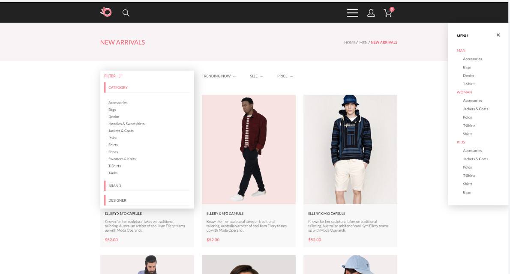

## Justina Sokolova

---

### Сontacts:

- **Phone:** +7(985)142-75-77
- **Telegram:** @Justina_sokolova
- **E-mail:** Justinasal@yandex.ru
- **Discord:** cinnamon_bun(@JustinaSokolova)
- **GitHub:** [JustinaSokolova](https://github.com/JustinaSokolova)

---

### About Myself

My acquaintance with frontend development happened about a year ago. And from the first steps I really fell in love with it. I really like to make up websites and immediately see the result. I have also always loved solving logic tasks, and I am very inspired by working in a team.

At first I studied by myself, using textbooks and available information from the Internet. When that wasn't enough, I went to study at the GeekBrains online University at the Frontend Development department. After six months of studying, I wanted to expand my skills in JavaScript practice. And by a lucky chance I came across the RS School.

My immediate goals are to deepen and consolidate my knowledge in this area and get a job in the second half of 2022. And in the future I plan to realize my full potential in this profession.

---

### Skills

- HTML5
- CSS3, SCSS
- BEM methodology
- Bootstrap
- JavaScript, DOM
- Gulp, Webpack
- Git, GitHub
- Figma

---

### Code example

```
function spinWords(string) {
        let array = string.split(" ");
        let str = "";

        for (let word of array) {
          str += " ";
          if (word.length >= 5) {
            str += word.split("").reverse().join("");
          } else {
            str += word;
          }
        }
        return str.trim();
      }
```

---

### Work experience

This is my educational project - an interactive clothing store website, with full adaptivity for desktop, tablet and mobile.
HTML and CSS only.

[Link for GitHub Pages](https://justinasokolova.github.io/GB-StoreWebsite/)



### Education

- Bachelor's degree, "Financial Management"
- GeekBrains University, "Frontend Development"

---

### Languages

- Russian - Native
- English - Pre-Intermediate (in the process of raising the level)
